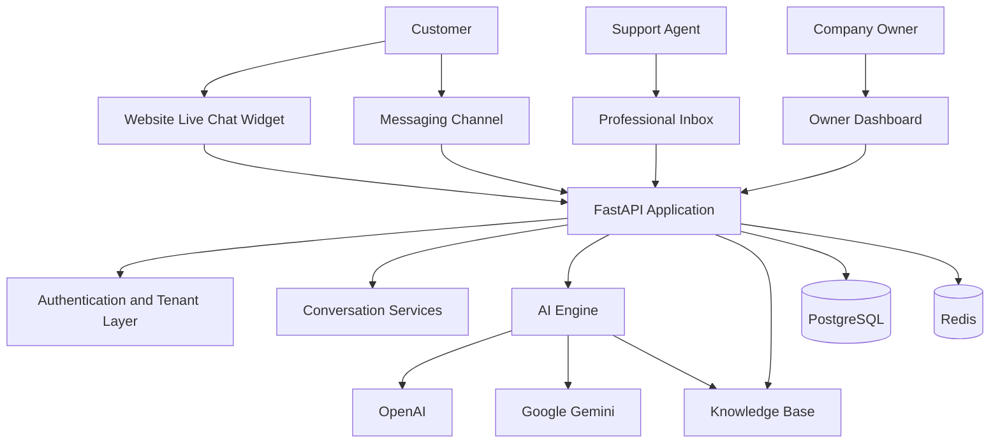

# System Architecture

## High-Level Architecture



## Backend Layers

```text
API Layer
    ↓
Service Layer
    ↓
Repository Layer
    ↓
SQLAlchemy Models
    ↓
PostgreSQL
```

## Multi-Tenant Design

Tenant isolation is applied to company data, contacts, conversations, messages, AI settings, Knowledge Base content, widget configuration, and team members.
